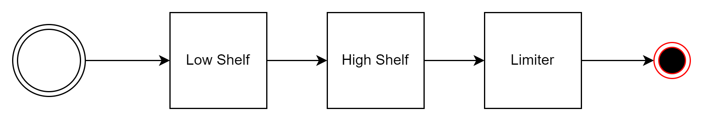
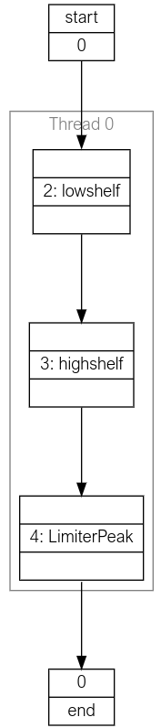
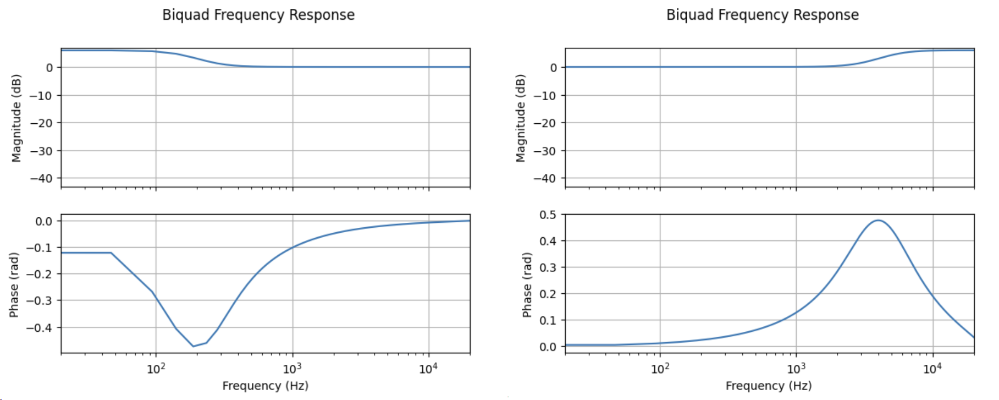

Using the Tool
##############

In this section the basic operation of the tools provided by lib_audio_dsp is
described. 

This document takes the user through three scenarios,
illustrated by way of the included example `app_simple_audio_dsp_integration`,
which may be found in the `examples` directory in `lib_audio_dsp`. 

These scenarios are: 

- Creating a pipeline 
- Tuning and simulating a pipeline
- Deploying pipeline code onto the xcore.

The steps in this guide should be executed in a `Jupyter Notebook`_.

Creating a Pipeline
===================

A simple yet useful DSP pipeline that could be made is a bass and treble control
with output limiter. In this design the product will stream real time audio
boosting or suppressing the treble and bass and then limiting the output
amplitude to protect the output device.

The DSP pipeline will perform the following processes:

   The target pipeline

The first step is to create an instance of the 
:py:class:`Pipeline<audio_dsp.design.pipeline.Pipeline>`
class. This is the top level class which
will be used to create and tune the pipeline. On creation the number of inputs
and sample rate must be specified.

.. code-block:: python

   from audio_dsp.design.pipeline import Pipeline

   pipeline, inputs = Pipeline.begin(
       1,          # Number of pipeline inputs.
       fs=48000    # Sample rate.
   )

The ``Pipeline`` object can now be used to add DSP stages. For high shelf and low 
shelf use :py:class:`Biquad <audio_dsp.stages.biquad.Biquad>` and for
the limiter use :py:class:`LimiterPeak <audio_dsp.stages.limiter.LimiterPeak>`.

.. code-block:: python

    from audio_dsp.design.pipeline import Pipeline
    from audio_dsp.stages import *

    p, inputs = Pipeline.begin(1, fs=48000)

    # i is a list of pipeline inputs. "lowshelf" is a label for this instance of Biquad.
    # The new variable x is the output of the lowshelf Biquad
    x = p.stage(Biquad, inputs, "lowshelf")

    # The output of lowshelf "x" is passed as the input to the
    # highshelf. The variable x is reassigned to the outputs of the new Biquad.
    x = p.stage(Biquad, x, "highshelf")

    # Connect highshelf to the limiter. Labels are optional, however they are required
    # if the stage will be tuned later.
    x = p.stage(LimiterPeak, x)

    # Finally connect to the output of the pipeline.
    p.set_outputs(x)

    p.draw()

:numref:`generated_pipeline_diagram` demonstrates the output of the Jupyter Notebook when the above snippet was executed.
Jupyter Notebook will illustrate the designed pipeline.

.. _generated_pipeline_diagram:

   Generated pipeline diagram

Tuning and simulating a pipeline
================================

Each stage contains a number of designer methods which can be identified as they
have the ``make_`` prefix. These can be used to configure the stages. The stages
also provide a ``plot_frequency_response()`` method which shows the magnitude
and phase response of the stage with its current configuration :numref:`freq_responce_bq_diagram`.
The two biquads created above will have a flat frequency response until they are tuned. The code
below shows how to use the designer methods to convert them into the low shelf
and high shelf that is desired. The individual stages are accessed using the
labels that were assigned to them when the stage was added to the pipeline.

.. code-block:: python

   # Make a low shelf with a centre frequency of 200 Hz, q of 0.7 and gain of +6 dB
   p["lowshelf"].make_lowshelf(200, 0.7, 6)
   p["lowshelf"].plot_frequency_response()

   # Make a high shelf with a centre frequency of 4000 Hz, q of 0.7 and gain of +6 dB
   p["highshelf"].make_highshelf(4000, 0.7, 6)
   p["highshelf"].plot_frequency_response()

.. _freq_responce_bq_diagram:

   Frequency response of the biquads (low shelf left, high shelf right)

For this tutorial the default settings for the limiter will provide adequate performance.

Code Generation
===============

With an initial pipeline complete, it is time to generate the xcore source code
and run it on a device. The code can be generated using the
:py:meth:`generate_dsp_main() <audio_dsp.design.pipeline.generate_dsp_main>`
function.

.. code-block:: python

   from audio_dsp.design.pipeline import generate_dsp_main
   generate_dsp_main(p)

The reference application should then provide instructions for compiling the
application and running it on the target device.

With that the tuned DSP pipeline will be running on the xcore device and can be
used to stream audio. The next step is to iterate on the design and tune it to
perfection. One option is to repeat the steps described above, regenerating the
code with new tuning values until the performance requirements are satisfied.

Designing Complex Pipelines
===========================

The audio dsp library is not limited to the simple linear pipelines shown above.
Stages can scale to take an arbitrary number of inputs, and the outputs of each
stage can be split and joined arbitrarily.

When created, every stage's initialiser returns an instance of
:py:class:`StageOutputList<audio_dsp.design.stage.StageOutputList>`, 
a container of 
:py:class:`StageOutput<audio_dsp.design.stage.StageOutput>`. 
The stage's outputs can be selected from
the ``StageOutputList`` by indexing into it, creating a new ``StageOutputList``, which
can be concatenated with other ``StageOutputList`` instances using the ``+``
operator. When creating a stage, it will require a ``StageOutputList`` as its
inputs.

The below shows an example of how this could work with a pipeline with 7 inputs.

.. code-block:: python

   # split the pipeline inputs
   i0 = p.stage(Biquad, i[0:2])      # use the first 2 inputs
   i1 = p.stage(Biquad, i[2])        # use the third input (index 2)
   i2 = p.stage(Biquad, i[3, 5, 6])  # use the inputs at index 3, 5, and 6
   # join biquad outputs
   i3 = p.stage(Biquad, i0 + i1 + i2[0]) # pass all of i0 and i1, as well as the first channel in i2

   p.set_outputs(i3 + i2[1:]) # The pipeline output will be all i3 channels and the 2nd and 3rd channel from i2.

As the pipeline grows it may end up consuming more MIPS than are available on a
single xcore thread. The pipeline design interface allows adding additional
threads using the 
:py:meth:`next_thread() <audio_dsp.design.pipeline.Pipeline.next_thread>` 
method of the ``Pipeline`` instance. Each thread
in the pipeline represents an xcore hardware thread. Do not add more threads
than are available in your application. The maximum number of threads that
should be used, if available, is five. This limitation is due to the architecture of the xcore
processor.

.. code-block:: python

    # thread 0
    i = p.stage(Biquad, i)

    # thread 1
    p.next_thread()
    i = p.stage(Biquad, i)

    # thread 2
    p.next_thread()
    i = p.stage(Biquad, i)
