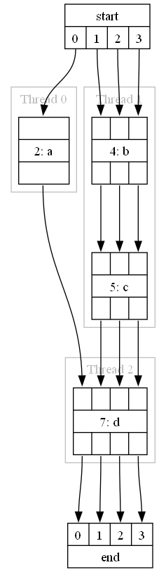

Summary of the xcore.ai architecture
====================================

A basic understanding of the xcore architecture is required in order to understand the consequences of various design
choices that can be made in the DSP pipeline.

An xcore application will consist of 1 or more xcore.ai chips connected together via a communication fabric (the
XLink). Each xcore.ai contains 2 or more tiles; a tile is an independent processor with its own memory. A tile cannot
read or write the memory of another tile. Each tile contains 8 logical cores; a logical core is an independent thread
of execution that will run some application code. Each tile also has 32 chanends available for allocation; connecting
2 chanends forms a channel, which allows for synchronous communication between any 2 logical cores in the system (even between tiles or
packages).

In its default configuration, an xcore.ai chip will operate at 600MHz; this means that each tile executes instructions
at a rate of 600MIPS. This is shared between the 8 logical cores by multiplexing the execution across 5 time slots. Each
thread can consume at most 1 time slot per scheduler cycle. The consequence of this is that for applications with up to
5 threads, each thread operates at 120MIPS (600/5). If there are over 5 threads then this number can be reduced down to
75MIPS (600/8). If any of the threads modify their priority mode then this can reduce the available MIPS even further;
high-priority threads are always guaranteed a slot in the scheduler on each cycle.

================= ===============
Term              Definition
================= ===============
xcore.ai          A chip containing 2 or more tiles.
Tile              A single processor with some memory.
Logical Core      1 of the 8 threads available in each tile.
Chanend           The physical hardware used by a logical core to create a channel. There are 32 available per tile.
Channel           The bidirectional communication pathway that is created when 2 chanends are connected.
================= ===============

For more information about the xcore architecture, consult `The XMOS XS3 Architecture`_ and the data sheet for your
package.

The Architecture of the Generated Pipeline
==========================================

:numref:`dsp-class-label` shows the relationship between the classes in an application with a generated DSP pipeline. A
class in this context refers to a C struct and the functions that operate on it.

.. _dsp-class-label:

.. figure:: ../images/dsp_class.drawio.png
   :width: 100%

   Class diagram of a lib_audio_dsp application

The application package contains Audio Source, Audio Sink and Control classes. The Audio Source and Sink are responsible
for producing and consuming audio at the rate required by the DSP pipeline. The Control is responsible for implementing
any application specific dynamic control of the DSP pipeline; this is optional and will only be present where run time
control is used. These are in the Application package as they will be unique for each application. Audio Source, Audio
Sink, and Control make use of the classes in lib_audio_dsp; all make use of a pointer to a shared `adsp_pipeline_t` (as
shown by the aggregation relationships (hollow diamond) in :numref:`dsp-class-label`). lib_audio_dsp presents a thread
safe API, allowing Audio Source, Audio Sink and Control to exist on separate threads if desired. However, they must all
exist on the same tile in order to access the shared `adsp_pipeline_t`.

The "lib_audio_dsp" repository represents the classes from this library. These APIs are documented fully in the Tool
User Guide.

The "Generated Pipeline" package represents the classes and objects which will be generated from the user's specified
DSP pipeline design. :numref:`dsp-class-label` shows that `adsp_generated_auto` is composed of (filled diamond) the
`adsp_pipeline_t` and multiple `module_instance_t`. Therefore, the generated pipeline is responsible for allocating
the memory for all the stages in the pipeline and also initialising each stage. The generated pipeline also creates
multiple threads (labelled `dsp_threadX` in :numref:`dsp-class-label`), each of which will have been uniquely
generated for the DSP pipeline that has been designed. The generated pipeline will always require at least 1 thread to
run the DSP on; it is not possible to generate a DSP pipeline that can be executed inline on an existing thread. It is
also not possible to split the DSP threads across more than 1 tile, because all threads access a shared `adsp_pipeline_t`
object.

To summarise, the generated DSP pipeline will consume the number of threads specified in the design (at least 1). At
least one other thread on the same tile must be available to exchange audio with the DSP pipeline.

Resource usage of the Generated Pipeline
========================================

The resources that are consumed by the generated DSP pipeline are threads, chanends, and memory. Each DSP thread also has a finite number of instructions per sample that are available for DSP. It is the responsibility of the DSP designer to ensure that this limit is not exceeded on any of the threads.

.. _design_chanend_usage_section:

Chanend Usage
-------------

The following snippet of Python shows a DSP design; the pipeline diagram for the snippet is shown
in :numref:`design_resources_gv_label`. This design splits 4 DSP stages amongst 3 threads. Threads 0 and 1 operate
on the pipeline inputs in parallel. Thread 2 receives its inputs from threads 0 and 1. The pipeline output comes from
thread 1.

The generated DSP threads and the APIs for exchanging inputs with the pipeline all use channels to communicate audio. 

.. literalinclude:: ../../test/pipeline/doc_examples/design_guide_resources.py
   :language: python
   :start-after: # start example
   :end-before: # end example

.. _design_resources_gv_label:

   Output of `Pipeline.draw()` for the example pipeline

:numref:`design_resources_chanends_label` shows how the chanends are allocated for this design. A channel (2 chanends)
is allocated for every connection from one thread to another. Thread 2 receives data from thread 0 and 1, therefore it
has 2 input channels. It only outputs to 1 thread (end) so has 1 output channel.

If multiple data channels are passed from 1 thread to another (e.g. 3 channels from thread 1 to 2) this still only
consumes a single xcore channel (2 chanends) as all the data channels are sent over the same xcore channel.

For a simple linear pipeline, the chanend usage will be :math:`2 * num_dsp_threads + 2`. For pipelines with parallel
threads the usage will be higher, as shown in :numref:`design_resources_chanends_label` where 10 chanends (5 channels) are
used for 3 DSP threads.

.. _design_resources_chanends_label:

.. figure:: ../images/chanends.drawio.png
   :width: 100%

   Chanend usage for the example pipeline

.. _design_thread_usage_section:

Thread Usage
------------

Thread usage of the DSP pipeline is discussed in the sections above. Understanding the thread usage of your application
is a manual process. The application designer must have an understanding of how many threads are in use in their
application as well as in the DSP pipeline to ensure that the limit of 8 is not exceeded. If this limit is exceeded the
xcore will trap when the application attempts to fork a ninth thread.

.. _design_memory_usage_section:

Memory Usage
------------

All memory used in the generated DSP pipeline is statically allocated and therefore known at compile time. The Python
design API cannot assist in understanding the memory usage of your application. The memory report which is displayed
when compiling the application must be consulted to see the memory used. This value will include the generated DSP
pipeline as well as any other application code that is running on the tile.

.. _design_mips_usage_section:

MIPS Usage
----------

In order to operate in a real time audio system it is critical that each thread in the DSP pipeline can complete
execution in less time than the sample period (or frame period if the frame size is greater than 1). It is this
constraint that requires the DSP to be split into pipelined threads. If a thread is overloaded, the DSP pipeline will
consume and produce samples at a slower rate than expected. This could cause the source and sink threads to block and
miss timing. The current version of lib_audio_dsp provides only limited support for measuring the MIPS usage of each
thread.

Each thread measures the total number of system ticks (periods of the system clock, by default a 100MHz clock) that pass
while it is doing work and stores the maximum value that has occured since boot. This measurement can be used to get
an estimate of the threads' MIPS utilisations. To access this value, the function `adsp_auto_print_thread_max_ticks()`
("auto" may be replaced with a custom pipeline identifier if specified) is generated along with the other generated
pipeline functions. Calling this function on the same tile as the pipeline will print the measured value. Printing
is implemented with `printf`, so the output will only be visible when connected to the device with `xrun` or `xgdb`.

The number of available ticks on each thread depends on the frame size and sample rate of the data. For example, given
that the system clock runs by default at 100MHz, if the sample rate is 48000 Hz and frame size is 1 then the available
ticks will be :math:`1 * 100e6/48000 = 2083 ticks`. Below is an example output from `adsp_auto_print_thread_max_ticks()`
for a pipeline with 4 threads::

   DSP Thread Ticks:
   0:     1800
   1:     181
   2:     67
   3:     93

The number that is displayed is the worst case that has happened since boot. This is not necessarily the absolute worst
case as some stages have data dependent execution time. Therefore, it is recommended to play an audio signal through the
pipeline with varying amplitude and frequencies before measuring the thread MIPS.

Troubleshooting resource issues
===============================

Tile exceeds memory limit
-------------------------

Memory available check will report "FAILED" during linking. The :ref:`design_memory_usage_section` section describes how
memory is allocated in the DSP pipeline. Recommended steps:

#. Remove all stages from the pipeline.
#. Add them back one at a time and take note of the memory usage of each stage. 
#. Consult the documentation for the problematic stages and see if its memory usage is configuration dependent.

Moving stages between threads will not impact the memory usage as all threads are on the same tile.

Tile exceeds available chanends
-------------------------------

If a tile attempts to allocate too many chanends it will raise an illegal resource exception and cease execution. This
can be detected easily with xgdb or xrun as it will print the following message::

   Unhandled exception: ILLEGAL_RESOURCE

The :ref:`design_chanend_usage_section` section describes how chanends are used within the DSP pipeline. Resolving this
problem will require either redesigning the DSP or the application that runs on the same tile to use fewer chanends.

Exchanging audio with the DSP pipeline blocks for too long
==========================================================

`adsp_pipeline_sink` or `adsp_pipeline_source` will block until data is available. The :ref:`design_mips_usage_section`
section describes how to ensure the DSP pipeline meets timing. Identifying this particular issue will depend on the rest
of the application. The result could be either dropped samples that are audible in the output or a complete application crash.

Tile exceeds available threads
------------------------------

If a tile attempts to fork too many threads it will raise an illegal resource exception and cease execution. This can be
detected easily with xgdb or xrun as it will print the following message::

   Unhandled exception: ILLEGAL_RESOURCE

The :ref:`design_thread_usage_section` section describes how threads are used within the DSP pipeline. Resolving this
problem will require either redesigning the DSP or the application that runs on the same tile to use fewer threads.
