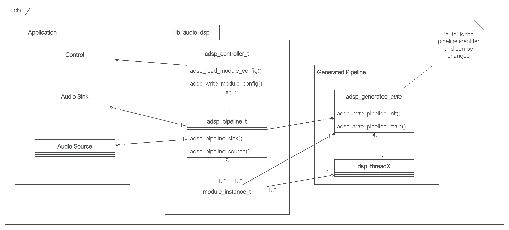

Design Guide
============

Introduction
^^^^^^^^^^^^

This guide will cover the details of how the xcore DSP pipeline is generated from the Python description. This should
enable the reader to debug their pipeline when issues arise and understand the resource usage of a generated DSP
pipeline. This is an advanced guide intended for users who are deep in the weeds of designing their DSP application. The
accompanying tool and component guides should be consulted for the basic process of using this tool.

Summary of the xcore.ai architecture
^^^^^^^^^^^^^^^^^^^^^^^^^^^^^^^^^^^^

A basic understanding of the xcore architecture is required in order to understand the consequences of various design choices that can be made in the DSP pipeline. 

An xcore application will consist of 1 or more xcore.ai chips connected together via a communication fabric (the XLink). Each xcore.ai contains 2 or more tiles, a tile is an independent processor with its own memory. A tile cannot read or write the memory of another tile. Each tile contains 8 logical cores, a logical core is an independent thread of execution that will run some application code. Each tile also has 32 chanends available for allocation, connecting 2 chanends allows for synchronous communication between any 2 logical cores in the system (even between tiles or packages).

In its default configuration, an xcore.ai chip will operate at 600MHz; this means that each tile executes instructions at a rate of 600MIPS. This is shared between the the 8 logical cores by multiplexing the execution across 5 time slots. Each thread can consume at most 1 time slot. The consequence of this is that for applications with up to 5 threads, each thread operates at 120MIPS (600/5). If there are over 5 threads then this number can be reduced down to 75MIPS (600/8). If any of the threads modify their priority mode then this can reduce the available MIPS even further.

================= ===============
Term              Definition
================= ===============
xcore.ai          A chip containing 2 or more tiles.
Tile              A single processor with some memory.
Logical Core      1 of the 8 threads available in each tile.
Chanend           The physical hardware used by a logical core to create a channel, there are 32 available per tile.
Channel           The bidirectional communication pathway that is created when 2 chanends are connected.
================= ===============

For more information about the xcore architecture, consult `The XMOS XS3 Architecture`_.

The Architecture of the Generated Pipeline
^^^^^^^^^^^^^^^^^^^^^^^^^^^^^^^^^^^^^^^^^^

:numref:`dsp-class-label` shows the relationship between the classes in an application with a generated DSP pipeline. As all the code is C, consider a class to be a group of functions, optionally with acting on a particular struct, groups usually identified by the .c/.h files that contain them. 

.. _dsp-class-label:

   Class diagram of a lib_audio_dsp application.

The class diagram is split into the following packages. "Application" contains an audio source and sink which are responsible for producing and consuming audio at the rate required by the DSP pipeline. There is also a "Control" class which is responsible for implementing any application specific dynamic control of the DSP pipeline; this is optional and will only be present where run time control is used. These are in the application package as they will be unique for each application. Audio source, audio sink, and control make use of the classes in lib_audio_dsp and therefore will all make use of a pointer to a shared adsp_pipeline_t (as shown by the aggregration relationships (hollow diamond) in :numref:`dsp-class-label`). Lib_audio_dsp presents a thread safe API, allowing audio source, audio sink and control to exist on separate threads. However, they must all exist on the same tile in order to access the shared adsp_pipeline_t.

The lib_audio_dsp package represents the classes from this library. These APIs are documented fully in the Tool User Guide. 

The "Generated Pipeline" package represents the classes and objects which will be generated from the users specified DSP pipeline design. :numref:`dsp-class-label` shows that `adsp_generated_auto` is composed of (filled diamond) the `adsp_pipeline_t`and multiple module_instance_t. Therefore the generated pipeline is responsible for allocating the memory for all of the stages in the pipeline and also initialising each stage. The generated pipeline also creates multiple threads (labelled `dsp_auto_threadX` in :numref:`dsp-class-label`), each of which will have been uniquely generated for the DSP pipeline that has been designed. The generated pipeline will always require at least 1 thread to run the DSP on, it is not possible to generated a DSP pipeline that can be executed inline on an existing thread. It is also not possible to split the DSP threads across more than 1 tile, all threads access the shared `adsp_pipeline_t`.

To summarise, the generated DSP pipeline will consume the number of threads specified in the design (at least 1). At least one other thread on the same tile must be available to exchange audio with the DSP pipeline. 

Understanding the Resource usage of the Generated Pipeline
^^^^^^^^^^^^^^^^^^^^^^^^^^^^^^^^^^^^^^^^^^^^^^^^^^^^^^^^^^

The resources that are consumed by the generated DSP pipeline are threads, chanends, and memory. Each DSP thread also has has a finite number of instructions per sample that are available for DSP. It is the responsibility of the DSP designer to ensure that this limit is not exceeded on any of the threads.

Chanend Usage
*************

The following snippet of Python shows a DSP design; the pipeline diagram for the snippet is shown in :numref:`design_resources_gv_label`. This design splits 4 DSP stages amongst 3 threads. Thread 0 and 1 operate on the pipeline inputs in parallel. Thread 2 receives its inputs from threads 0 and 1. The pipeline output comes from thread 1.

The generated DSP threads and the APIs for exchanging inputs with the pipeline all use channels to communicate audio. 

.. literalinclude:: ../../test/pipeline/doc_examples/design_guide_resources.py
   :language: python
   :start-after: # start example
   :end-before: # end example

.. _design_resources_gv_label:

.. figure:: design_guide_resources.gv.png
   :width: 20%

   Output of `Pipeline.draw()` for the example pipeline.

:numref:`design_resources_chanends_label` shows how the chanends are allocated for this design. A channel (2 chanends) is allocated for every connection from one thread to another. Thread 2 receives data from thread 0 and 1, therefore it has 2 input channels. It only outputs to 1 thread (end) so has 1 output channel. 

If multiple data channels are passed from 1 thread to another (e.g. 3 channels from from thread 1 to 2) this still only consumes a single xcore channel (2 chanends) as all the data channels are sent over the same xcore channel.

For a simple linear pipeline, the chanend usage will be :math:`2 * num_dsp_threads + 2`. For pipelines with parallel threads this will be higher, as shown in the example where 10 chanends (5 channels) are used for 3 DSP threads.

.. _design_resources_chanends_label:

   Chanend usage for the example pipeline.

Thread Usage
************

Thread usage of the DSP pipeline is discussed in the sections above. Understanding the thread usage of your application is a manual process. The application designer must have an understanding of how many threads are in use in their application as well as in the DSP pipeline to ensure that the limit of 8 is not exceeded. If this limit is exceeded the xcore will trap when the application attempts to fork a ninth thread.

Memory Usage
************

All memory used in the generated DSP pipeline is statically allocated and therefore known at compile time. The Python design API cannot assist in understanding the memory usage of your application. The memory report which is displayed when compiling the application must be consulted to see the memory used. This value will include the generated DSP pipeline as well as any other application code that is running on the tile.

MIPS Usage
**********

In order to operate in a real time audio system it is critical that each thread in the DSP pipeline can complete execution in less time than the sample period (or frame period if the frame size is greater than 1). It is this constraint that requires the DSP to be split into pipelined threads. If a thread is overloaded, the DSP pipeline will consume and produce samples at a slower rate than expected. This could cause the source and sink threads to block and miss timing. The current version of lib_audio_dsp provides only limited support for measuring the MIPS usage of each thread.

Each thread measures the total number of system ticks that pass while it is doing work and stores the maximum value that has occured since boot. This measurement can be used to get an estimate of the threads' MIPS utilisations. To access this value, the function `adsp_auto_print_thread_max_ticks()` ("auto" may be replaced with a custom pipeline identifier if specified) is generated along with the other generated pipeline functions. Calling this on the same tile as the pipeline will print this value. This uses `printf`, so the output will only be visible when connected to the device with `xrun` or `xgdb`.

The number of available ticks on each thread depends on the frame size and sample rate of the data. For example, given that the system clock runs by default at 100MHz, if the sample rate is 48000 Hz and frame size is 1 then the available ticks will be :math:`1 * 100e6/48000 = 2083 ticks`. Below is an example output from `adsp_auto_print_thread_max_ticks()` for a pipeline with 4 threads::

   DSP Thread Ticks:
   0:     1800
   1:     181
   2:     67
   3:     93

The number that is displayed is the worst case that has happened since boot. This is not necessarily the absolute worst case as some stages have data dependant execution time. Therefore, it is recommended to play an audio signal through the pipeline with varying amplitude and frequencies before measuring the thread MIPS.
