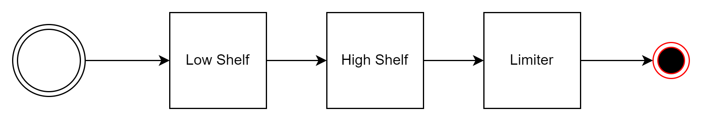
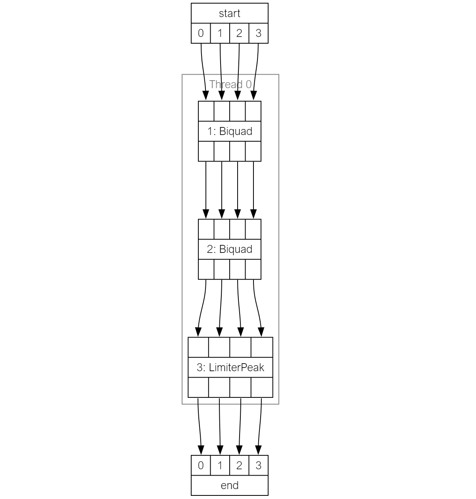
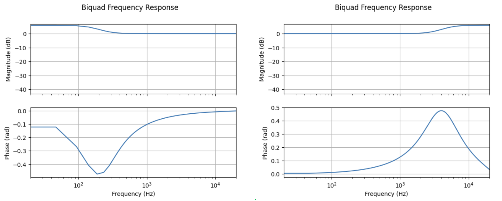

PIPELINE DESIGN TUTORIAL
########################

This page will walk through the basics of designing an audio DSP pipeline for the xcore with the audio_dsp
python library. This does not include adding the generated code in an application and assumes that
the reader has a reference application to run their pipeline on. Such a reference design can be found in
the xmos/sw_audio_dsp github repository.

The steps in this guide should be executed in a Jupyter notebook.

Making a simple tone control
============================

Design Phase
------------

A simple yet useful DSP pipeline that could be made is a bass and treble control with output limiter. In this
design the product will stream realtime audio boosting or suppressing the treble and bass and then limiting
the output amplitude to protect the output device.

The DSP pipeline will perform the following processes:

   The target pipeline.

The first step is to create an instance of the :py:class:`Pipeline <audio_dsp.design.pipeline.Pipeline>` class. This
is the top level class which will be used to create and tune the pipeline. On creation the number of inputs and sample
rate must be specified.

.. code-block:: python

   from audio_dsp.design.pipeline import Pipeline

   p = Pipeline(
       4,          # Number of pipeline inputs.
       fs=48000    # Sample rate.
   )

The xcore is a multithreaded processor and the audio_dsp library can make full use of this. The first thing to do with the newly created pipeline instance is to add a thread.

.. code-block:: python

   # add an initial thread
   with p.add_thread() as t:
      ...

The thread object can now be used to add DSP stages. For high shelf and lowshelf use :py:class:`Biquad <audio_dsp.stages.biquad.Biquad>` and for
the limiter use :py:class:`LimiterPeak <audio_dsp.stages.limiter.LimiterPeak>`.

.. code-block:: python

    from audio_dsp.design.pipeline import Pipeline
    from audio_dsp.stages.biquad import Biquad
    from audio_dsp.stages.limiter import LimiterPeak

    p = Pipeline(4, fs=48000)
    with p.add_thread() as t:

        # p.i is a list of pipeline inputs.
        lowshelf = t.stage(Biquad, p.i)

        # The output of lowshelf "lowsheld.o" is pass as the input to the
        # highshelf.
        highshelf = t.stage(Biquad, lowshelf.o)

        # Connect highshelf to the limiter.
        limiter = t.stage(LimiterPeak, highshelf.o)

    # Finally connect the last stage to the output of the pipeline.
    p.set_outputs(limiter.o)

    p.draw()

When running the above snippet in a jupyter notebook it will output the following image which illustrates the pipeline which has been designed:

   Generated pipeline diagram

This example shows how to add stages to the thread and configure the pipeline outputs. Every stage has an :py:attr:`o <audio_dsp.design.stages.Stage.o>` attribute.
This is a list of stage output instances. When creating a stage, all stages will require a list of stage outputs as it's inputs. A stages outputs can be sliced and joined
with another stages output and passed as an input to a third stage.

.. code-block:: python

    with p.add_thread() as t:
       # split the pipeline inputs
       b0 = t.stage(Biquad, p.i[0:2]
       b1 = t.stage(Biquad, p.i[2:])

       # join biquad outputs
       b2 = t.stage(Biquad, b0.o + b1.o)

Tuning Phase
------------

Each stage contains a number of designer methods which can be identified as they have the ``make_`` prefix. These can be used to configure
the stages. The stages also provide a ``plot_frequency_response()`` method which shows the magnitude and phase response of the stage with
its current configuration. The two biquads created above will have a flat frequency response until they are tuned. The code below shows
how to use the designer methods to convert them into the lowshelf and highself that is desired.

.. code-block:: python

   # Make a lowshelf with a centre frequency of 200 Hz, q of 0.7 and gain of +6 dB
   lowshelf.make_lowshelf(200, 0.7, 6)
   lowshelf.plot_frequency_response()

   # Make a highshelf with a centre frequency of 4000 Hz, q of 0.7 and gain of +6 dB
   highshelf.make_highshelf(4000, 0.7, 6)
   highshelf.plot_frequency_response()

   Frequency response of the biquads (lowshelf left, highshelf right).

For this tutorial the default settings for the limiter will provide adequate performance.

Code Generation
---------------

With an initial pipeline complete, it is time to generate the xcore source code and run it on a device. The code can be generated
using the :py:class:`generate_dsp_main() <audio_dsp.design.pipeline.generate_dsp_main>` function::

    from audio_dsp.design.pipeline import generate_dsp_main
    generate_dsp_main(p)

The reference application you are using should then provide instructions for compiling the application and running it on the target device.

With that the tuned DSP pipeline will be running on the xcore device and can be used to stream audio. The next step is to iterate on the design
and tune it to perfection. One option is to repeat the steps described above, regenerating the code with new tuning values until the performance requirements are satisfied.
But a faster option is described below which allows run time tuning of the stages in the pipeline.

Run time configuration and profiling
------------------------------------

The audio dsp python library provides support for interfacing with the host control application that is available with the sw_audio_dsp reference
application. There are 2 operations which can be performed. The first is to send new configuration to a device which is already running. As long
as the structure of the pipeline has not changed, the configuration of the pipeline can be changed in real time for convenient tuning::

    from audio_dsp.design.host_app import set_host_app
    from audio_dsp.design.pipeline import send_config_to_device, profile_pipeline

    set_host_app("path/to/xvf_host")  # pass the correct path to a host app here

This will use the host app to send configuration to the devices whilst it is running. This will not update the generated code and therefore the
device configuration will be lost when it is switched off. Rerun ``generate_dsp_main()`` in order to create an application with updated tuning parameters
baked in.

    # send the current config to the device
    send_config_to_device(p)

The second is for profiling the thread utilisation. This will display a table which reports the percentage utilisation of each thread. This number is measured
whilst the device is running and the value displayed is the worst case that has been observed since the device booted for each thread::

    # Read back the thread utilisation
    profile_pipeline(p)
