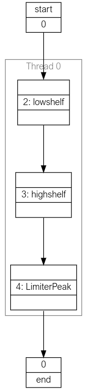

.. _using_the_tool:

Using the Tool
##############

In this section the basic operation of the tools provided by lib_audio_dsp is
described. 

This document takes the user through three scenarios,
illustrated by way of the included example `app_simple_audio_dsp_integration`,
which may be found in the `examples` directory in `lib_audio_dsp`. 

These scenarios are: 

- Creating a pipeline 
- Tuning and simulating a pipeline
- Deploying pipeline code onto the xcore.

The steps in this guide should be executed in a `Jupyter Notebook`_.

Creating a Pipeline
===================

A simple yet useful DSP pipeline that could be made is a bass and treble control
with output limiter. In this design the product will stream real time audio
boosting or suppressing the treble and bass and then limiting the output
amplitude to protect the output device.

The DSP pipeline will perform the processes shown in :numref:`bass_treble_pipeline`.

.. _bass_treble_pipeline:

.. figure:: ../images/bass_treble_limit.drawio.png
   :width: 100%

   The target pipeline

The first step is to create an instance of the 
:py:class:`Pipeline<audio_dsp.design.pipeline.Pipeline>`
class. This is the top level class which
will be used to create and tune the pipeline. On creation the number of inputs
and sample rate must be specified.

.. code-block:: python

   from audio_dsp.design.pipeline import Pipeline

   pipeline, inputs = Pipeline.begin(
       1,          # Number of pipeline inputs.
       fs=48000    # Sample rate.
   )

The ``Pipeline`` object can now be used to add DSP stages. For high shelf and low 
shelf use :ref:`Biquad_stage` and for
the limiter use :ref:`LimiterPeak_stage`.
For a full list of available DSP stages, see the :ref:`dsp_stages_list`.

.. code-block:: python

    from audio_dsp.design.pipeline import Pipeline
    from audio_dsp.stages import *

    p, inputs = Pipeline.begin(1, fs=48000)

    # i is a list of pipeline inputs. "lowshelf" is a label for this instance of Biquad.
    # The new variable x is the output of the lowshelf Biquad
    x = p.stage(Biquad, inputs, "lowshelf")

    # The output of lowshelf "x" is passed as the input to the
    # highshelf. The variable x is reassigned to the outputs of the new Biquad.
    x = p.stage(Biquad, x, "highshelf")

    # Connect highshelf to the limiter. Labels are optional, however they are required
    # if the stage will be tuned later.
    x = p.stage(LimiterPeak, x)

    # Finally connect to the output of the pipeline.
    p.set_outputs(x)

    p.draw()

:numref:`generated_pipeline_diagram` demonstrates the output of the Jupyter Notebook when the above snippet was executed.
The Jupyter Notebook will illustrate the designed pipeline. For information on creating more complex
pipeline topologies, see :ref:`complex_pipelines`.

.. _generated_pipeline_diagram:

   Generated pipeline diagram

Tuning and simulating a pipeline
================================

Each stage contains a number of designer methods which can be identified as they
have the ``make_`` prefix. These can be used to configure the stages. The stages
also provide a ``plot_frequency_response()`` method which shows the magnitude
and phase response of the stage with its current configuration :numref:`freq_responce_bq_diagram`.
The two biquads created above will have a flat frequency response until they are tuned. The code
below shows how to use the designer methods to convert them into the low shelf
and high shelf that is desired. The individual stages are accessed using the
labels that were assigned to them when the stage was added to the pipeline.

.. code-block:: python

   # Make a low shelf with a centre frequency of 200 Hz, q of 0.7 and gain of +6 dB
   p["lowshelf"].make_lowshelf(200, 0.7, 6)
   p["lowshelf"].plot_frequency_response()

   # Make a high shelf with a centre frequency of 4000 Hz, q of 0.7 and gain of +6 dB
   p["highshelf"].make_highshelf(4000, 0.7, 6)
   p["highshelf"].plot_frequency_response()

.. _freq_responce_bq_diagram:

.. figure:: ../images/frequency_response.png
   :width: 100%

   Frequency response of the biquads (low shelf left, high shelf right)

For this tutorial the default settings for the limiter will provide adequate performance.

Code Generation
===============

With an initial pipeline complete, it is time to generate the xcore source code
and run it on a device. The code can be generated using the
:py:meth:`generate_dsp_main() <audio_dsp.design.pipeline.generate_dsp_main>`
function.

.. code-block:: python

   from audio_dsp.design.pipeline import generate_dsp_main
   generate_dsp_main(p)

The reference application should then provide instructions for compiling the
application and running it on the target device.

.. note::
   `Application Note AN02014 <https://www.xmos.com/file/an02014-integrating-dsp-into-the-xmos-usb-reference-design/>`_
   discusses integrating a DSP pipeline into the XMOS USB Reference Design.

The :py:meth:`generate_dsp_main() <audio_dsp.design.pipeline.generate_dsp_main>`
function will cause the tuned DSP pipeline to run on the xcore device,
where it can be used to stream audio.
The next step is to iterate on the design and tune it to perfection.
One option is to repeat the steps described above, regenerating the
code with new tuning values until the performance requirements are satisfied.

.. _complex_pipelines:

Designing Complex Pipelines
===========================

The audio dsp library is not limited to the simple linear pipelines shown above.
Stages can scale to take an arbitrary number of inputs, and the outputs of each
stage can be split and joined arbitrarily.

When creating a new DSP pipeline, the initialiser returns the pipeline input channels as
an instance of
:py:class:`StageOutputList<audio_dsp.design.stage.StageOutputList>`, a list-like container of 
:py:class:`StageOutput<audio_dsp.design.stage.StageOutput>`.
When adding a new stage to the pipeline, a ``StageOutputList`` is used to pass the stage inputs.
The stage initialiser returns a new instance of ``StageOutputList`` containing its outputs.

To select specific channels from a ``StageOutputList`` to pass to another
stage, standard Python indexing can be used. Channels from multiple instances of
``StageOutputList`` can be combined by using the ``+`` operator.

The below shows an example of how this could work with a pipeline with 7 inputs.

.. code-block:: python

    # start with 7 input channels
    p, inputs = Pipeline.begin(7, fs=48000)

   # pass the first 2 inputs to a 2-channel Biquad
   i0 = p.stage(Biquad, i[0:2])

   # pass the third input (index 2) to a 1-channel biquad
   i1 = p.stage(Biquad, i[2])

   # pass the inputs at index 3, 5, and 6 to a 3 channel biquad
   i2 = p.stage(Biquad, i[3, 5, 6])

   # pass all of i0 and i1, as well as the first channel in i2
   # to create a 4 channel biquad
   i3 = p.stage(Biquad, i0 + i1 + i2[0]) 

   # The pipeline output has 6 channels:
   # - all four i3 channels 
   # - the 2nd and 3rd channel from i2
   p.set_outputs(i3 + i2[1:])

In order to split a signal path, a :ref:`Fork_stage` stage
should be used. This takes a count parameter that specifies how many times to duplicate each input to
the ``Fork``. The code block below shows how the signal chain can be forked:

.. code-block:: python

    p, inputs = Pipeline.begin(1, fs=48000)

    # fork the input to create a 2 channel signal
    x = p.stage(Fork, inputs, count=2)

    # fork again to create a 4 channel signal
    x = p.stage(Fork, x, count=2)

    # there are now 4 channels in the pipeline output
    p.set_outputs(x)

As the pipeline grows it may end up consuming more MIPS than are available on a
single xcore thread. The pipeline design interface allows adding additional
threads using the 
:py:meth:`next_thread() <audio_dsp.design.pipeline.Pipeline.next_thread>` 
method of the ``Pipeline`` instance. Each thread
in the pipeline represents an xcore hardware thread. Do not add more threads
than are available in your application. The maximum number of threads that
should be used, if available, is five. This limitation is due to the architecture of the xcore
processor.

.. code-block:: python

    # thread 0
    i = p.stage(Biquad, i)

    # thread 1
    p.next_thread()
    i = p.stage(Biquad, i)

    # thread 2
    p.next_thread()
    i = p.stage(Biquad, i)

When using multiple threads, the signal paths must cross the same number of 
threads to reach the output. Failure to do this will result in threads blocking
one another, and a reduced pipeline throughput. 

The pipeline below is not acceptable, as the 
first channel crosses 2 threads, whilst the second channel only crosses one.

.. code-block:: python

    p, inputs = Pipeline.begin(2, fs=48000)

    # inputs[1] is not used on thread 0
    x1 = p.stage(Biquad, inputs[0])

    p.next_thread()

    # inputs[1] first used on thread 1
    x = p.stage(Biquad, x1 + inputs[1])

    p.set_outputs(x)

To ensure signal paths cross the same number of threads, ``Bypass`` Stages
can be used.

.. code-block:: python

    p, inputs = Pipeline.begin(2, fs=48000)

    # both inputs are not used on this thread
    x1 = p.stage(Biquad, inputs[0])
    x2 = p.stage(Bypass, inputs[1])

    p.next_thread()

    x = p.stage(Biquad, x1 + x2)

    p.set_outputs(x)

Parallel thread paths are also permitted. In the below case, the inputs
are passed to separate threads before being used in a third.

.. code-block:: python

    p, inputs = Pipeline.begin(2, fs=48000)

    x1 = p.stage(Biquad, inputs[0])
    p.next_thread()

    x2 = p.stage(Bypass, inputs[1])
    p.next_thread()

    # x1 and x2 have both crossed 1 thread already
    x = p.stage(Biquad, x1 + x2)

    p.set_outputs(x)

.. _json_format:

DSP Pipeline JSON Format
========================

For integrating with external tools, such as GUIs, the DSP pipeline can
be exported to a JSON format. To define and enforce the JSON schema,
pydantic models of each stage are used. To convert a pipeline to JSON,
the following steps can be followed:

.. code-block:: python

    from audio_dsp.design.pipeline import Pipeline
    from audio_dsp.design.parse_json import DspJson, pipeline_to_dspjson, make_pipeline
    from pathlib import Path
    from audio_dsp.stages import Biquad

    p, inputs = Pipeline.begin(1, fs=48000)
    x = p.stage(Biquad, inputs)
    p.set_outputs(x)

    # Generate the pydantic model of the pipeline
    json_data = pipeline_to_dspjson(p)

    # write the JSON data to a file
    filepath = Path("pipeline.json")
    filepath.write_text(json_data.model_dump_xdsp())

    # read the JSON data back to a DSP pipeline
    json_text = filepath.read_text()
    json_data = DspJson.model_validate_json(json_text)
    p = make_pipeline(json_data)
