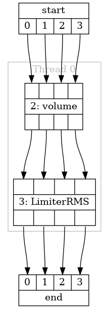

Run-Time Control User Guide
===========================

Introduction
^^^^^^^^^^^^

For many applications, the ability to update the DSP configuration at run time will be required. A simple example
would be a volume control where the end product will update the volume setting based on user input. This
DSP library has been designed with use cases like this in mind and the generated DSP pipeline provides an interface for
writing and reading the configuration of each stage.

This document details how to use this interface to extend a DSP application with run-time control
of the audio processing. For a complete example of an application that updates the DSP configuration
based on user input refer to application note AN02015.

Control Interface Walkthrough
^^^^^^^^^^^^^^^^^^^^^^^^^^^^^

Defining a Controllable Pipeline
********************************

This section will walk through adding control to a basic DSP pipeline. The following code snippet
describes a simple DSP process with a volume control and a limiter. In the end application the 
volume can be set by the application.

.. literalinclude:: ../../test/pipeline/doc_examples/run_time_control.py
   :language: python
   :start-after: # start example
   :end-before: # end example

This code snippet will generate the pipeline diagram shown in :numref:`run_time_example_fig`.

.. _run_time_example_fig:

   The example pipeline diagram.

In this example the tuning methods on the stages in the pipeline are not called which means
the code that is generated will intialise the stages with their default configuration values.

A point of interest in this example is that the `label` argument to the pipeline `stage`
method is set, but only for the volume control stage. The label for the volume control in 
this example is "volume". After generating the source code for this pipeline, a file will
be created in the specified directory named "adsp_instance_id_auto.h" (assuming that the pipeline
identifier has been left as its default value of "auto"). The contents of the generated file are shown below:

.. literalinclude:: ../../test/pipeline/doc_examples/run_time_dsp/src/dsp/adsp_instance_id_auto.h
   :language: C

In this file the macro `volume_stage_index` is defined. The value of this macro can be used by
the control interface to find the volume control stage and process control commands. The benefit
of this to an application author is that this header file can be included in the application and
the value of `volume_stage_index` will always be correct, even when the pipeline is redesigned.

Writing the Configuration of a Stage
************************************

Each stage type has a set of controllable parameters that can be read or written. A description of
each parameter along with its type and name can be found in the :ref:`dsp_stages_section` section
in the DSP components document. For volume control, there is a command named `CMD_VOLUME_CONTROL_TARGET_GAIN`
that can be updated at run time to set the volume. This command is defined in the generated header file
"cmds.h". This will be placed into the build directory at `src.autogen/common/cmds.h`, which contains all
the command IDs for all the stage types that were found by CMake.

It is also possible to see the available control parameters, along with the values they will be set to, while
designing the pipeline in Python. This can be done using the `get_config` method of the stage as shown below.

.. literalinclude:: ../../test/pipeline/doc_examples/run_time_control.py
   :language: python
   :start-after: # start config
   :end-before: # end config

This will print this dictionary of parameters:

.. literalinclude:: ../../test/pipeline/doc_examples/run_time_dsp/config.txt

This dictionary does not contain `CMD_VOLUME_CONTROL_TARGET_GAIN`, but is does contain "target_gain". The final
command name is constructed as "CMD_{STAGE_TYPE}_{PARAMETER}" where stage type and parameter should be replaced with
the correct values for each, capitalised. All stages of the same type (e.g. `VolumeControl`) will have the same
set of parameters. 

The format and type of the control parameters for each stage are chosen to optimise processing time on the
DSP thread. For example, `CMD_VOLUME_CONTROL_TARGET_GAIN` is not a floating point value in decibels, but rather
a linear fixed point value. For this example we can use the convenience function
`adsp_dB_to_gain()` which is defined in `dsp/signal_chain.h`.

In order to send a control command, the API defined in `stages/adsp_control.h` is used. This API is documented in the
Tool User Guide, in the :ref:`pipeline_design_api` section. Complete the
following steps:

#. Create a thread that will be updating the DSP configuration. This thread must be on the same tile as the DSP.

#. Create a new `adsp_controller_t` from the `adsp_pipeline_t` that was initialised for the generated pipeline. If
   multiple threads will be attempting control, each thread must have a unique instance of `adsp_controller_t` to ensure
   thread safety.

#. Initialise a new `adsp_stage_control_cmd_t`, specifying the instance ID (`volume_stage_index`), the command
   ID (`CMD_VOLUME_CONTROL_TARGET_GAIN`), and payload length (`sizeof(int32_t)`).

#. Create the command payload; this will be an `int32_t` containing the computed gain. Update the command payload
   pointer to reference the payload.

#. Call `adsp_write_module_config` until it returns `ADSP_CONTROL_SUCCESS`. There may be in-progress write or read 
   commands which have been issued but not completed when starting the new command. In this scenario
   the `adsp_write_module_config` will return `ADSP_CONTROL_BUSY` which means that the attempt to write had no 
   effect and should be attempted again.

A full example of a control thread that does this is shown below.

.. literalinclude:: ../../test/pipeline/doc_examples/run_time_dsp/src/main.c
   :language: C
   :start-after: // start example
   :end-before: // end example

Reading the Configuration of a Stage
************************************

In some cases it makes sense to read back the configuration of the stage. Some stages have dynamic values that are 
updated as the audio is processed and can be read back to the control thread. Volume control is an example of this
as it will smoothly adjust the gain towards `CMD_VOLUME_CONTROL_TARGET_GAIN`; the current value of the gain which
is actually being applied can be read by reading from the parameter `CMD_VOLUME_CONTROL_GAIN`. The API for reading
is largely the same as writing, except the control API will write to the payload buffer.

This code example shows how to read the current `CMD_VOLUME_CONTROL_GAIN` parameter from the "volume" stage that
is created in the example above.

.. literalinclude:: ../../test/pipeline/doc_examples/run_time_dsp/src/main.c
   :language: C
   :start-after: // start read
   :end-before: // end read

Control Interface Details
^^^^^^^^^^^^^^^^^^^^^^^^^

This section provides a brief overview of how the control interface works.

Each stage that is included in the generated DSP pipeline has its own state which it will maintain as it processes
audio. It also has a structure that contains its configuration parameters. Finally, it has a control state variable
which is used to communicate between the DSP and control threads. Threads that wish to read or write to the
configuration of a stage use the control API that is discussed above.

For a write command, the controlling thread will check that a command is not ongoing by querying the control state of
the stage. If the stage is not processing a control command then the control thread will update the configuration struct
for the stage and write to the control state variable that new parameters are available. When the DSP thread next gets
an opportunity the stage will see that the parameters have been updated and update its internal state to match. When
this is complete the control state variable will be cleared. 

For a read command the process is similar. The control thread requests a read by updating the control state variable.
The stage will see this and update the configuration struct with the latest value and notify the control thread, via the
control state variable, that it has completed the request.

The control API ensures thread safety through the use of the `adsp_controller_t` struct. As long as each thread uses
a unique instance of `adsp_controller_t` then the control APIs will return `ADSP_CONTROL_BUSY` if a command that was
initialised by another `adsp_controller_t` is ongoing.
